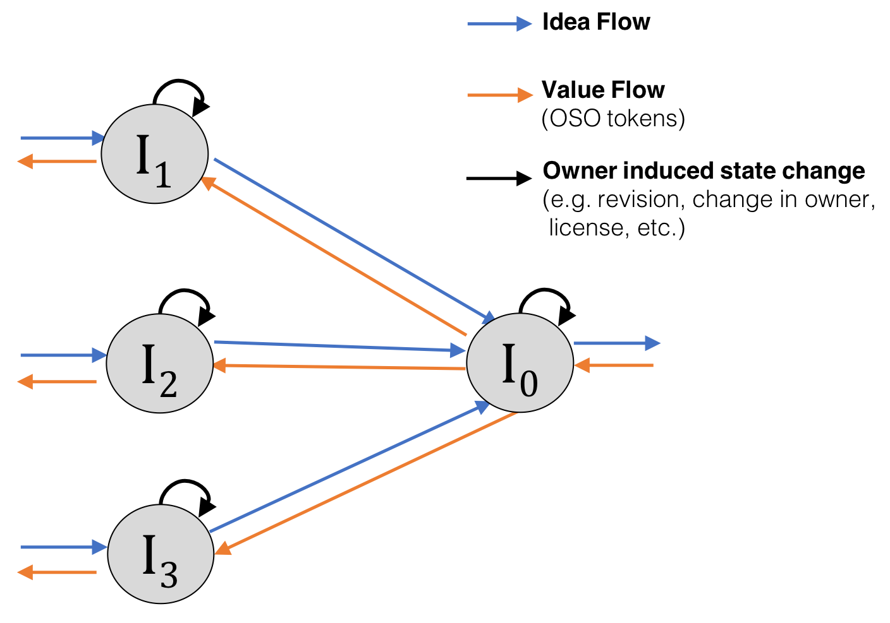
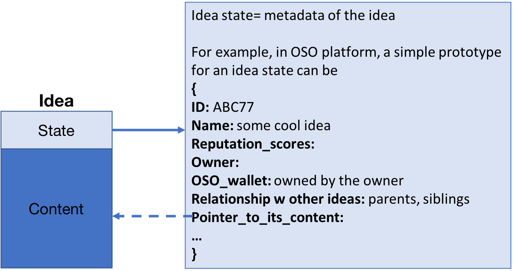
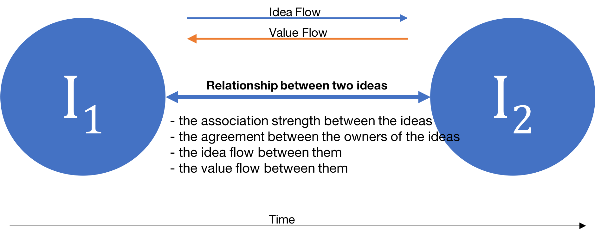
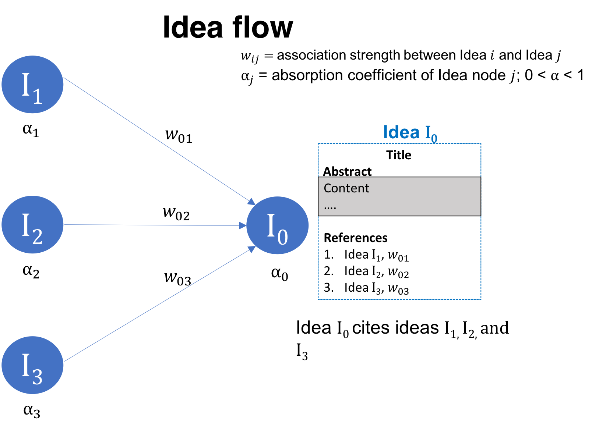
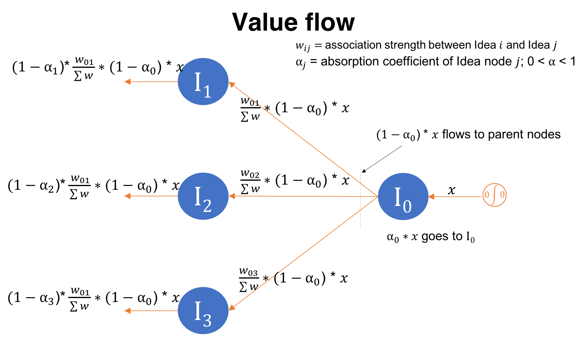
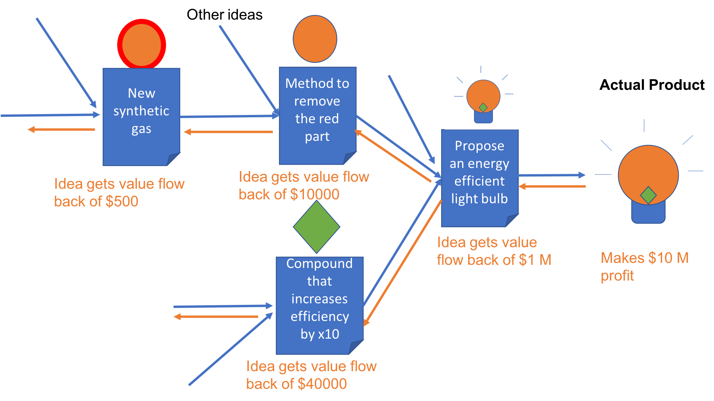

# Generalized Idea Protocol (GIP) 
previously called **Interplanetary Idea System (IPIS)**

An absolute minimum viable product would look like  https://gist.github.com/noman-land/64db658bbfa15c1d487ea1544c8e2d88  (author: Noman)

Research or any intellectual process can be fully described by three basic components: 1) Definition of an intellectual contribution (i.e. Idea object) 2) Relationship among idea objects, 3) State change of the idea objects in response to an action by an agent or group of agents (i.e. users). Generalized Idea Protocol (GIP) (https://github.com/open-science-org/GIP}{https://github.com/open-science-org/GIP) describes these three components. GIP fully defines an idea, its relationship with other ideas, and its state change in response to a user (e.g. researcher). 

**Representing all Human Knowledge by a Graph**
With the representation of the ideas by GIP, the collection of the ideas will form a directed graph (digraph) that grows over time.
A directed graph is an ordered pair $G = (V, E)$ where $V$ is a set of elements, called vertices or nodes and $E$ is a set of ordered pairs of vertices, called directed edges or simply edges
[Bang-Jensen, Jørgen; Gutin, Gregory (2000), Digraphs: Theory, Algorithms and Applications, Springer, ISBN 1-85233-268-9]
In OSO platform, a node in the digraph will represent an idea (say $I_3$) and will contain enough information to describe the idea. The edge between two nodes (representing ideas $I_1$ and $I_2$) will describe the relationship (magnitude and direction of idea and value flow) between $I_1$ and $I_2$.

### What is an Idea?
Idea is an entity which generates new information at the time of its creation. It can be a publication, book, website, blog, data, legal document, or anything physical/virtual object or concept.

### What is GIP?
GIP is a protocol that defines an idea and the relationship between two or more ideas. The relationship between two ideas will define:
- the association strength between the ideas
- the agreement between the owners of the ideas 
- the idea flow between them
- the value flow between them. If an idea B which is dependent on idea A generates value of $100, how is this value shared to the idea A? and how does the value shared to idea A (let's say $5) is shared to the ideas it was based upon? In other words, how does the value flow back?

With GIP, each unique idea can be identified and its evolution over the time can be tracked. In addition, it will give us a framework to evaluate the relationship between two different ideas. One way of modeling GIP would be by a directed acyclic graph (DAG) that grows over time. Each node of the DAG will be an GIP object representing a unique idea.  An GIP object will contain all the information required to represent a unique idea. If there is a publication or data (stored as an IPFS object) related to an idea, its GIP object will contain the cryptographic hash of the IPFS object. 

GIP will allow us to track the evolution of ideas over time as well as quantify the similarity of two ideas. The similarity score can be a hybrid of the market-driven score (decided by the scientific community via voting) and the algorithmic score generated from the GIP protocol. GIP will facilitate the efficient sharing of the ideas and prevent the community from reinventing wheels, thereby accelerating the pace of the scientific research. In addition, a good visualization of GIP objects will help the scientific community to identify the pain points of scientific research. Similarly, it can be used to find the optimal distribution of available resources (e.g. fund allocation) required in order to maximize scientific throughput. Loosely speaking, GIP will store the collective thought process of the whole scientific community.

### Mathematical Definition
Mathematically, GIP is a directed acyclic graph (DAG) that grown over time. Each node in GIP contains enough information to describe a unique idea I. The edge between two nodes representing ideas I1 and I2 will show the relationship (magnitude and direction of idea/information flow) between I1 and I2.

### Idea Flow

Idea I_0 cites Idea I_1, I_2, and I_3. Here the idea I_0 is borrowing some knowldge from the cited publications (its parent ideas), so the idea flows from I_1, I_3, and I_3 to I_0.

### Value Flow

The value (in form of OSO tokens) flows backward i.e. opposite to the idea flow.

## GIP v.0.0 (basic version)
*we will implement this first*

Each node of GIP will represent a publication and an edge will represent the direction of “idea flow”; the strength of relationship (or magnitude) is same for all idea pairs. This means first order “cost of idea” is same across the graph. However, it can be user dependent by design. For example, let’s say an entity publishes a publication A where publications B, C, D, & E are cited. In other words, the costs of idea of publications B, C, D, & E are equal for publication A. However, if the entity feels (and the reviewer agrees) that the publication A is more dependent on publications B & D, the entity can redistribute the costs of idea as (B, C, D, E) = (5, 1, 10, 1).

### Practical Examples
